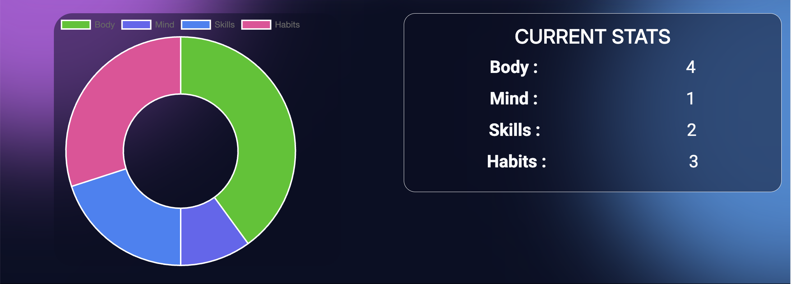
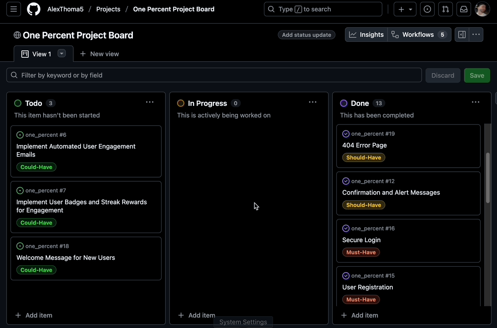

# [one_percent](https://one-percent-6389037dbddb.herokuapp.com)

Developer: Alex Thomas ([AlexThoma5](https://www.github.com/AlexThoma5))

[](https://www.github.com/AlexThoma5/one_percent/commits/main)
[](https://www.github.com/AlexThoma5/one_percent/commits/main)
[](https://www.github.com/AlexThoma5/one_percent)
[](https://one-percent-6389037dbddb.herokuapp.com)

One Percent is a personal growth and habit-tracking web application. It helps users focus on small, consistent improvements. Its name reflects the idea that getting 1% better every day leads to remarkable progress. Users log daily updates across categories like Body, Mind, Skills, and Habits. The simple but powerful dashboard allows users to visualise and reflect on their journey.

The goal of the project is to encourage consistency, reflection, and accountability. Users create and edit logs in various growth categories. Progress appears visually through charts. Users track daily efforts in one convenient place. With both structure and flexibility, One Percent supports lasting habits.

I chose to develop One Percent for my MS3 project because I have always been interested in self-development, and I felt that putting myself in the user’s shoes would help me design a more effective application. The concept of improving “one percent each day” resonates with me personally, and this project provided an opportunity to translate that philosophy into a functional and meaningful tool that others can use to achieve their goals.


Live site can be found [here](https://one-percent-6389037dbddb.herokuapp.com).


## UX

### The 5 Planes of UX

#### 1. Strategy

**Purpose**
- Provide users with a platform to track, log and reflect on their personal growth and daily habits.
- Offer a simple and intuitive dashboard to visualise progress across categories chosen by the site owner.

**Primary User Needs**
- Users need an easy way to create, edit, and review logs for different personal growth categories.
- Users need visual tools, like charts, to understand their progress over time.

**Business Goals**
- Promote self-improvement through consistency and incremental progress.
- Ensure a clean, user-friendly interface that makes tracking personal growth simple and enjoyable.
- Ensure easy category management for owners.

#### 2. Scope

**[Features](#features)** (see below)

**Content Requirements**
- Ability for users to create, update, and delete personal logs in categories such as Body, Mind, Skills, and Habits.
- Visualisation tools (charts and summaries) to display log data. 
- User account features (register, log in, edit/delete personal logs).
- Notification system for successful/unsuccessful log actions (add/edit/delete).
- 404 error page for lost users.

#### 3. Structure

**Information Architecture**
- **Navigation Menu**:
  - Links to Dashboard and Log Out (for logged-in users).
  - Links to Sign Up and Log In (for guest users).
- **Hierarchy**:
  - Landing Page: The main content and visuals introduce the app’s purpose, with a prominent Sign Up call-to-action to encourage new users to register.
  - Dashboard: This page is the central hub for users once logged in. It allows users to quickly see progress in different categories through charts and easily navigate to individual category pages. 
  - Category Detail Pages: These pages are displayed prominently for logging and reviewing progress. The Add Log button is clearly visible, making it easy for users to create new entries.
  - Log Cards: Each log entry includes Edit and Delete icons, allowing users to manage their logs directly from the category page using modals, keeping the UI clean and uncluttered.

**User Flow**
1. Guest users browse landing page → see and overview of the app and its benefits.
2. Guest users click the sign-up CTA → register for an account.
3. Registered users log in → arrive at personal dashboard.
4. Registered users on their dashboard → view all categories and navigate to category detail page.
5. Registered users arrive at category page → prompted to add logs.
6. Registered users manage logs → create, edit or delete entries.
7. Returning users on the Dashboard → view categories and data visuals of progress if logs exist.

#### 4. Skeleton

**[Wireframes](#wireframes)** (see below)

#### 5. Surface

**Visual Design Elements**
- **[Colours](#colour-scheme)** (see below)
- **[Typography](#typography)** (see below)

### Colour Scheme

The website uses a dark, atmospheric theme with subtle glowing gradients and layered transparency.
Rather than solid backgrounds, components use semi-transparent overlays that let the dynamic background shine through. I've always been a huge fan of Apple and their simple yet beautiful UIs. This led me down the path of using opacity and layering to create depth and a modern feel throughout my site.

I used [coolors.co](https://coolors.co/0a0f24-4aa8ff-d46aff-ffffff-d1d5db) to generate my color palette.

- #0A0F24 primary background.
- #4AA8FF right glow / accent blue.
- #D46AFF left glow / accent pink.
- #FFFFFF primary text.
- #D1D5DB secondary text.

(Note: Transparent overlays use rgba(10,15,36,0.5–0.95) to allow the dynamic glowing background to show through.)


### Typography

While maintaining a modern, Apple-esque aesthetic, I chose fonts that reflect clarity, simplicity, and readability. My goal was to create a clean, professional look that complements the overall dark, glowing design of the site.

- [Inter](https://fonts.google.com/specimen/Inter) was used for the headers and titles.
- [Roboto](https://fonts.google.com/specimen/Roboto) was used for all other body text.
- [Font Awesome](https://fontawesome.com) icons were used throughout the site, such as the social media icons in the footer and category icons.

## Wireframes

To follow best practice, wireframes were developed for mobile, tablet, and desktop sizes.
I've used [Balsamiq](https://balsamiq.com/wireframes) to design my site wireframes.

| Page | Mobile | Tablet | Desktop |
| --- | --- | --- | --- |
| Landing |  |  |  |
| Register |  |  |  |
| Login |  |  |  |
| Dashboard |  |  |  |
| Category page |  |  |  |
| Log Out |  |  |  |
| 404 |  |  |  |

## User Stories

| Target | Expectation | Outcome |
| --- | --- | --- |
| As a site owner | I would like to view, edit, or delete any user logs if necessary | so that I can maintain data integrity and moderation. |
| As a site owner | I would like to manage log categories via the admin panel | so that I can tailor the website to my users' needs. |
| As a site owner | I would like to implement automated emails (e.g., welcome or reminder notifications) | so that users stay engaged over time. |
| As a registered user | I would like to earn badges or streaks for consistency | so that I feel motivated to maintain my habits. |
| As a registered user | I would like to view my personal dashboard after logging in | so that I can see an overview of my progress. |
| As a registered user | I would like to add a new log entry to a category | so that I can record my daily or weekly progress. |
| As a registered user | I would like to edit or delete existing log entries | so that I can manage or correct my data. |
| As a registered user | I would like my logs to show the timestamp | so that I can see when I made or edited it. |
| As a registered user | I would like to receive confirmation or alert messages (e.g., “Log added successfully”) | so that I know my actions were completed correctly. |
| As a registered user | I would like the dashboard and category pages to be responsive on all devices | so that I can track my progress anywhere. |
| As a registered user | I would like to see a chart with a visual breakdown of my logs | so that I can quickly understand and reflect on my growth. |
| As a new user | I would like to register for an account | so that I can begin tracking my personal growth. |
| As a new user | I would like to log in securely after registering | so that I can access my dashboard and saved data. |
| As a new user | I would like to view the landing page before signing up | so that I can understand what the site offers. |
| As a new user | I would like to receive a welcome message | so that I know how to start using the dashboard. |
| As a user | I would like to see a 404 error page if I get lost | so that it's obvious that I've stumbled upon a page that doesn't exist. |


## Features

### Existing Features

| Feature | Notes | Screenshot |
| --- | --- | --- |
| Register | Authentication is handled by allauth, allowing users to register accounts. |  |
| Login | Authentication is handled by allauth, allowing users to log in to their existing accounts. |  |
| Logout | Authentication is handled by allauth, allowing users to log out of their accounts. |  |
| Landing Page | The homepage introduces the site’s purpose — to help users improve by 1% every day — and provides links to register or log in. |  |
| Dashboard | Displays a personalised overview of the user’s progress, including all categories (Body, Mind, Skills, Habits) and a visual chart of logged activities. |  |
| Data visualation chart | A Chart.js chart dynamically updates to show the breakdown of logs per category, helping users visualise their journey. |  |
| Category Page | The homepage introduces the site’s purpose — to help users improve by 1% every day — and provides links to register or log in. |  |
| Add Log Entry | Authenticated visitors can comment on blog posts; comments require approval before being published. |  |
| Edit Log Entry | Authenticated visitors can edit their own comments. |  |
| Delete Log Entry | Authenticated visitors can delete their own comments. |  |
| Dynamic Background | The entire site features a glowing, animated background that changes size. This feature adds another level of depth to site, making it feel modern and alive. |  |
| User Feedback | Clear Django messages and notification banners provide instant feedback for actions ( successful/unsuccesful log actions) |  |
| Manage Categories | Site owners can add/manage categories from the Django admin dashboard. |  |
| Manage Logs | Site owners can manage/perform CRUD on any user logs from the Django admin dashboard. |  |
| Heroku Deployment | The site is fully deployed to Heroku, making it accessible online and easy to manage. |  |
| 404 | The 404 error page will indicate when a user has navigated to a page that doesn't exist, replacing the default Heroku 404 page with one that ties into the site's look and feel. |  |

### Future Features

- **Reward System**: Allow users to gain rewards (badges/streaks) for consistent logging. Boosting motivation and encouraging long-term engagement
- **Log Search Functionality**: Add a search bar for users to quickly find logs by keywords.
- **User Profiles**: Allow users to create a custom profile with their own profile picture and personal details.
- **Goals List**: A list for the users goals, that they can check off as they achieve them.
- **Achievement Sharing**: Add social media sharing buttons (e.g., Twitter, Facebook, LinkedIn) for users to share their latest achievements.
- **Improved Data Visuals**: Provide users with a larger variety of data visuals for a more detailed breakdown of their activity
- **Admin Dashboard Analytics**: Provide site admins with a dedicated analytics view to monitor user activity and inform category creation or deletion decisions.
- **Custom Themes for Users**: Allow users to customise the visual theme of the site (colors, fonts, etc.) to suit their preferences.

## Tools & Technologies

| Tool / Tech | Use |
| --- | --- |
| [](https://markdown.2bn.dev) | Generate README and TESTING templates. |
| [](https://git-scm.com) | Version control. (`git add`, `git commit`, `git push`) |
| [](https://github.com) | Secure online code storage. |
| [](https://code.visualstudio.com) | Local IDE for development. |
| [](https://en.wikipedia.org/wiki/HTML) | Main site content and layout. |
| [](https://en.wikipedia.org/wiki/CSS) | Design and layout. |
| [](https://www.javascript.com) | User interaction on the site. |
| [](https://www.python.org) | Back-end programming language. |
| [](https://www.heroku.com) | Hosting the deployed back-end site. |
| [](https://getbootstrap.com) | Front-end CSS framework for modern responsiveness and pre-built components. |
| [](https://www.djangoproject.com) | Python framework for the site. |
| [](https://www.postgresql.org) | Relational database management. |
| [](https://whitenoise.readthedocs.io) | Serving static files with Heroku. |
| [](https://balsamiq.com/wireframes) | Creating wireframes. |
| [](https://fontawesome.com) | Icons. |
| [](https://chat.openai.com) | Help debug, troubleshoot, and explain things. |
| [](https://www.chartjs.org) | Interactive data visualization charts on the user Dashboard. |
| [](https://michalsnik.github.io/aos) | Animate on Scroll Library |
| [](https://djlint.com/) | Used as Django template formatter |

## Database Design

### Data Model

Entity Relationship Diagrams (ERD) help to visualize database architecture before creating models. Understanding the relationships between different tables can save time later in the project.

I have used `Mermaid` to generate an interactive ERD of my project.


source: [Mermaid](https://www.mermaidchart.com/d/dce66046-5c9a-4cfd-a37d-4251a50542cc)

## Agile Development Process

### GitHub Projects

[GitHub Projects](https://www.github.com/AlexThoma5/one_percent/projects) served as an Agile tool for this project. Through it, User Stories and issues/bugs tasks were planned, then subsequently tracked on a regular basis using the Kanban project board.



### GitHub Issues

[GitHub Issues](https://www.github.com/AlexThoma5/one_percent/issues) served as an another Agile tool. There, I managed my User Stories and tracked any issues/bugs.

| Link | Screenshot |
| --- | --- |
| [](https://www.github.com/AlexThoma5/one_percent/issues?q=is%3Aissue%20is%3Aopen) |  |
| [](https://www.github.com/AlexThoma5/one_percent/issues?q=is%3Aissue%20is%3Aclosed) |  |

### MoSCoW Prioritization

I've decomposed my Epics into User Stories for prioritizing and implementing them. Using this approach, I was able to apply "MoSCoW" prioritization and labels to my User Stories within the Issues tab.

- **Must Have**: guaranteed to be delivered - required to Pass the project (*max ~60% of stories*)
- **Should Have**: adds significant value, but not vital (*~20% of stories*)
- **Could Have**: has small impact if left out (*the rest ~20% of stories*)
- **Won't Have**: not a priority for this iteration - future features

## Testing

> [!NOTE]  
> For all testing, please refer to the [TESTING.md](TESTING.md) file.

## Deployment

The live deployed application can be found deployed on [Heroku](https://one-percent-6389037dbddb.herokuapp.com).

> [!IMPORTANT]  
> Certain packages in `requirements.txt` are included to support DjLint, ensuring Django templates are properly linted and formatted.

### Heroku Deployment

This project uses [Heroku](https://www.heroku.com), a platform as a service (PaaS) that enables developers to build, run, and operate applications entirely in the cloud.

Deployment steps are as follows, after account setup:

- Select **New** in the top-right corner of your Heroku Dashboard, and select **Create new app** from the dropdown menu.
- Your app name must be unique, and then choose a region closest to you (EU or USA), then finally, click **Create App**.
- From the new app **Settings**, click **Reveal Config Vars**, and set your environment variables to match your private `env.py` file.

> [!IMPORTANT]  
> This is a sample only; you would replace the values with your own if cloning/forking my repository.

| Key | Value |
| --- | --- |
| `DATABASE_URL` | user-inserts-own-postgres-database-url |
| `DISABLE_COLLECTSTATIC` | 1 (*this is temporary, and can be removed for the final deployment*) |
| `SECRET_KEY` | any-random-secret-key |

Heroku needs some additional files in order to deploy properly.

- [requirements.txt](requirements.txt)
- [Procfile](Procfile)
- [.python-version](.python-version)

You can install this project's **[requirements.txt](requirements.txt)** (*where applicable*) using:

- `pip3 install -r requirements.txt`

If you have your own packages that have been installed, then the requirements file needs updated using:

- `pip3 freeze --local > requirements.txt`

The **[Procfile](Procfile)** can be created with the following command:

- `echo web: gunicorn app_name.wsgi > Procfile`
- *replace `app_name` with the name of your primary Django app name; the folder where `settings.py` is located*

The **[.python-version](.python-version)** file tells Heroku the specific version of Python to use when running your application.

- `3.12` (or similar)

For Heroku deployment, follow these steps to connect your own GitHub repository to the newly created app:

Either (*recommended*):

- Select **Automatic Deployment** from the Heroku app.

Or:

- In the Terminal/CLI, connect to Heroku using this command: `heroku login -i`
- Set the remote for Heroku: `heroku git:remote -a app_name` (*replace `app_name` with your app name*)
- After performing the standard Git `add`, `commit`, and `push` to GitHub, you can now type:
	- `git push heroku main`

The project should now be connected and deployed to Heroku!

### PostgreSQL

This project uses a [Code Institute PostgreSQL Database](https://dbs.ci-dbs.net) for the Relational Database with Django.

> [!CAUTION]
> - PostgreSQL databases by Code Institute are only available to CI Students.
> - You must acquire your own PostgreSQL database through some other method if you plan to clone/fork this repository.
> - Code Institute students are allowed a maximum of 8 databases.
> - Databases are subject to deletion after 18 months.

To obtain my own Postgres Database from Code Institute, I followed these steps:

- Submitted my email address to the CI PostgreSQL Database link above.
- An email was sent to me with my new Postgres Database.
- The Database connection string will resemble something like this:
    - `postgres://<db_username>:<db_password>@<db_host_url>/<db_name>`
- You can use the above URL with Django; simply paste it into your `env.py` file and Heroku Config Vars as `DATABASE_URL`.

### WhiteNoise

This project uses the [WhiteNoise](https://whitenoise.readthedocs.io/en/latest/) to aid with static files temporarily hosted on the live Heroku site.

To include WhiteNoise in your own projects:

- Install the latest WhiteNoise package:
    - `pip install whitenoise`
- Update the `requirements.txt` file with the newly installed package:
    - `pip freeze --local > requirements.txt`
- Edit your `settings.py` file and add WhiteNoise to the `MIDDLEWARE` list, above all other middleware (apart from Django’s "SecurityMiddleware"):

```python
# settings.py

MIDDLEWARE = [
    'django.middleware.security.SecurityMiddleware',
    'whitenoise.middleware.WhiteNoiseMiddleware',
    # any additional middleware
]
```


### Local Development

This project can be cloned or forked in order to make a local copy on your own system.

For either method, you will need to install any applicable packages found within the [requirements.txt](requirements.txt) file.

- `pip3 install -r requirements.txt`.

You will need to create a new file called `env.py` at the root-level, and include the same environment variables listed above from the Heroku deployment steps.

> [!IMPORTANT]  
> This is a sample only; you would replace the values with your own if cloning/forking my repository.

Sample `env.py` file:

```python
import os

os.environ.setdefault("SECRET_KEY", "any-random-secret-key")
os.environ.setdefault("DATABASE_URL", "user-inserts-own-postgres-database-url")

# local environment only (do not include these in production/deployment!)
os.environ.setdefault("DEBUG", "True")
```

Once the project is cloned or forked, in order to run it locally, you'll need to follow these steps:

- Start the Django app: `python3 manage.py runserver`
- Stop the app once it's loaded: `CTRL+C` (*Windows/Linux*) or `⌘+C` (*Mac*)
- Make any necessary migrations: `python3 manage.py makemigrations --dry-run` then `python3 manage.py makemigrations`
- Migrate the data to the database: `python3 manage.py migrate --plan` then `python3 manage.py migrate`
- Create a superuser: `python3 manage.py createsuperuser`
- Load fixtures (*if applicable*): `python3 manage.py loaddata file-name.json` (*repeat for each file*)
- Everything should be ready now, so run the Django app again: `python3 manage.py runserver`

If you'd like to backup your database models, use the following command for each model you'd like to create a fixture for:

- `python3 manage.py dumpdata your-model > your-model.json`
- *repeat this action for each model you wish to backup*
- **NOTE**: You should never make a backup of the default *admin* or *users* data with confidential information.

#### Cloning

You can clone the repository by following these steps:

1. Go to the [GitHub repository](https://www.github.com/AlexThoma5/one_percent).
2. Locate and click on the green "Code" button at the very top, above the commits and files.
3. Select whether you prefer to clone using "HTTPS", "SSH", or "GitHub CLI", and click the "copy" button to copy the URL to your clipboard.
4. Open "Git Bash" or "Terminal".
5. Change the current working directory to the location where you want the cloned directory.
6. In your IDE Terminal, type the following command to clone the repository:
	- `git clone https://www.github.com/AlexThoma5/one_percent.git`
7. Press "Enter" to create your local clone.

Alternatively, if using Ona (formerly Gitpod), you can click below to create your own workspace using this repository.

[](https://gitpod.io/#https://www.github.com/AlexThoma5/one_percent)

**Please Note**: in order to directly open the project in Ona (Gitpod), you should have the browser extension installed. A tutorial on how to do that can be found [here](https://www.gitpod.io/docs/configure/user-settings/browser-extension).

#### Forking

By forking the GitHub Repository, you make a copy of the original repository on our GitHub account to view and/or make changes without affecting the original owner's repository. You can fork this repository by using the following steps:

1. Log in to GitHub and locate the [GitHub Repository](https://www.github.com/AlexThoma5/one_percent).
2. At the top of the Repository, just below the "Settings" button on the menu, locate and click the "Fork" Button.
3. Once clicked, you should now have a copy of the original repository in your own GitHub account!

### Local VS Deployment

There are no remaining major differences between the local version when compared to the deployed version online.

## Credits

### Content

| Source | Notes |
| --- | --- |
| [Markdown Builder](https://markdown.2bn.dev) | Help generating Markdown files |
| [I Think Therefore I Blog](https://codeinstitute.net) | Code Institute walkthrough project inspiration |
| [Bootstrap](https://getbootstrap.com) | Various components / responsive front-end framework |
| [Bootstrap Template](https://startbootstrap.com/previews/one-page-wonder) | Template inspiration for landing page |
| [Whitenoise](https://whitenoise.readthedocs.io) | Static file service |
| [Python Tutor](https://pythontutor.com) | Additional Python help |
| [ChatGPT](https://chatgpt.com) | Help with code logic, debugging and explanations. Extra help with chart.js chart |
| [AOS Library](https://michalsnik.github.io/aos/) | Animations used across site |

### Media

| Source | Notes |
| --- | --- |
| [favicon.io](https://favicon.io) | Generating the favicon |
| [Font Awesome](https://fontawesome.com) | Icons used throughout the site |
| [Chart.js](https://www.chartjs.org/) | Doughnut chart on dashboard |
| [Google fonts](https://fonts.google.com/) | Fonts used throughout the site |


### Acknowledgements

- I would like to thank my Code Institute mentor, [Tim Nelson](https://www.github.com/TravelTimN) for the support throughout the development of this project.
- I would like to thank the [Code Institute](https://codeinstitute.net) Tutor Team for their assistance with troubleshooting and debugging some project issues.
- I would like to thank the [Code Institute Slack community](https://code-institute-room.slack.com) and [Code Institute Discord community](https://discord-portal.codeinstitute.net) for the moral support; it kept me going during periods of self doubt and impostor syndrome.


