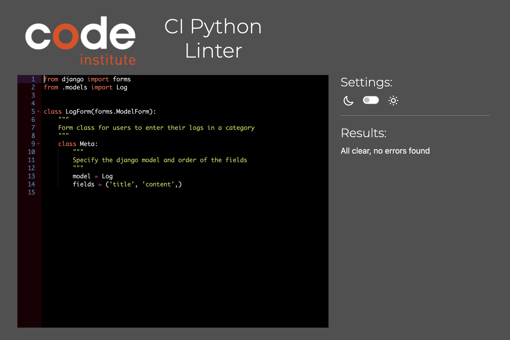
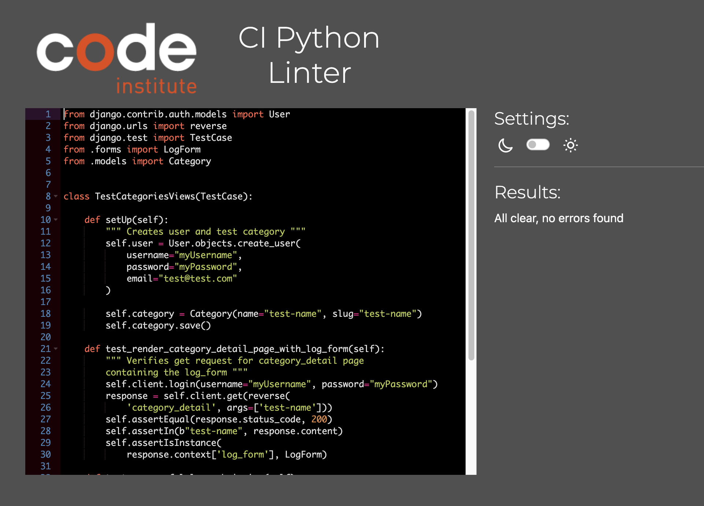
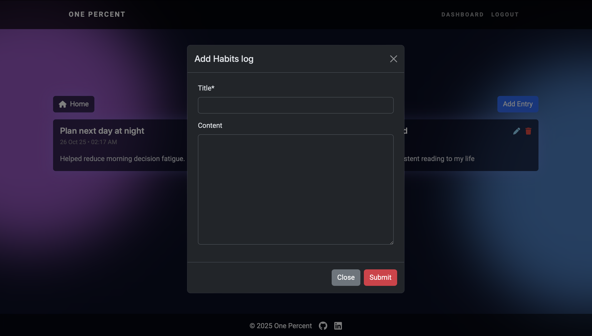
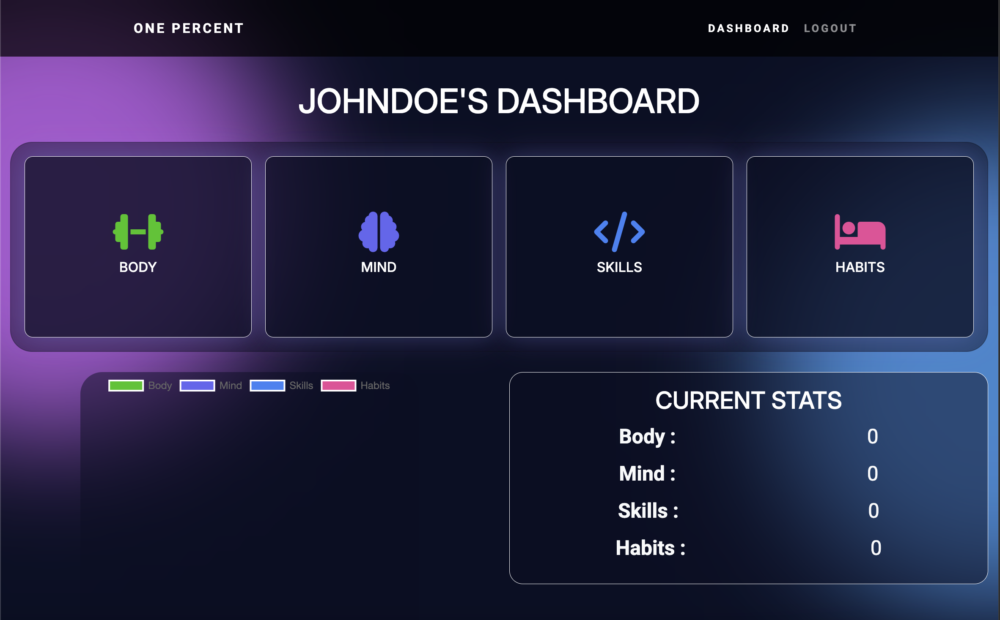
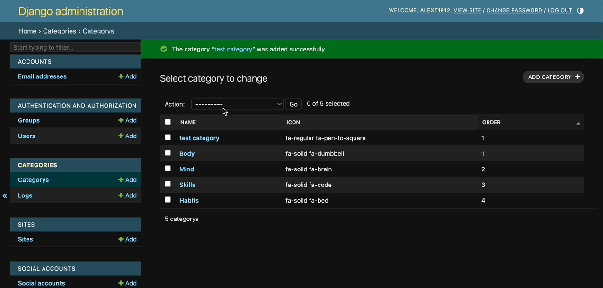

# Testing

> [!NOTE]  
> Return back to the [README.md](README.md) file.

## Code Validation

### HTML

I have used the recommended [HTML W3C Validator](https://validator.w3.org) to validate all of my HTML files.

| Directory | File | URL | Screenshot | Notes |
| --- | --- | --- | --- | --- |
| dashboard | [landing.html](https://github.com/AlexThoma5/one_percent/blob/main/dashboard/templates/dashboard/landing.html) |[W3C Link](https://validator.w3.org/nu/?doc=https%3A%2F%2Fone-percent-6389037dbddb.herokuapp.com%2Flanding%2F) |  |  || categories | [category_detail.html](https://github.com/AlexThoma5/one_percent/blob/main/categories/templates/categories/category_detail.html) | N/A |  | Validated by input - No link |
| dashboard | [dashboard.html](https://github.com/AlexThoma5/one_percent/blob/main/dashboard/templates/dashboard/dashboard.html) | N/A |  | Validated by direct input - No link |
| templates | [400.html](https://github.com/AlexThoma5/one_percent/blob/main/templates/errors/400.html) | N/A |  | Validated by direct input - No link |
| templates | [403.html](https://github.com/AlexThoma5/one_percent/blob/main/templates/errors/403.html) | N/A |  | Validated by direct input - No link |
| templates | [404.html](https://github.com/AlexThoma5/one_percent/blob/main/templates/errors/404.html) | N/A |  | Validated by direct input - No link |
| templates | [500.html](https://github.com/AlexThoma5/one_percent/blob/main/templates/errors/500.html) | N/A |  | Validated by direct input - No link |
| templates | [login.html](https://github.com/AlexThoma5/one_percent/blob/main/templates/account/login.html) | [W3C Link](https://validator.w3.org/nu/?doc=https%3A%2F%2Fone-percent-6389037dbddb.herokuapp.com%2Faccounts%2Flogin%2F) |  |  |
| templates | [signup.html](https://github.com/AlexThoma5/one_percent/blob/main/templates/account/signup.html) | [W3C Link](https://validator.w3.org/nu/?doc=https%3A%2F%2Fone-percent-6389037dbddb.herokuapp.com%2Faccounts%2Fsignup%2F) |  |  |
| templates | [logout.html](https://github.com/AlexThoma5/one_percent/blob/main/templates/account/logout.html) | N/A |  | Validated by direct input - No link |

### CSS

I have used the recommended [CSS Jigsaw Validator](https://jigsaw.w3.org/css-validator) to validate all of my CSS files.

| Directory | File | URL | Screenshot | Notes |
| --- | --- | --- | --- | --- |
| static | [style.css](https://github.com/AlexThoma5/one_percent/blob/main/static/css/style.css) | [W3C CSS Link](https://jigsaw.w3.org/css-validator/validator?uri=https://one-percent-6389037dbddb.herokuapp.com/static/css/style.css) |  | Warnings appear due to autoprefixer vendor extensions |

When validating by URI, I recieved errors due to the AOS library used for animations across the site.

Here is the link to see the errors:

- [W3C CSS Link](https://jigsaw.w3.org/css-validator/validator?uri=https://one-percent-6389037dbddb.herokuapp.com)

### JavaScript

I have used the recommended [JShint Validator](https://jshint.com) to validate all of my JS files.

| Directory | File | URL | Screenshot | Notes |
| --- | --- | --- | --- | --- |
| static | [chart.js](https://github.com/AlexThoma5/one_percent/blob/main/static/js/chart.js) |  |  | 'new' is needed for chart.js, therefore ignored warning. |
| static | [logs.js](https://github.com/AlexThoma5/one_percent/blob/main/static/js/logs.js) |  |  | Undefined variable caused by Bootstrap external library |

### Python

I have used the recommended [PEP8 CI Python Linter](https://pep8ci.herokuapp.com) to validate all of my Python files.

| Directory | File | URL | Screenshot |
| --- | --- | --- | --- |
| categories | [admin.py](https://github.com/AlexThoma5/one_percent/blob/main/categories/admin.py) | [PEP8 CI Link](https://pep8ci.herokuapp.com/https://raw.githubusercontent.com/AlexThoma5/one_percent/main/categories/admin.py) |  |
| categories | [forms.py](https://github.com/AlexThoma5/one_percent/blob/main/categories/forms.py) | [PEP8 CI Link](https://pep8ci.herokuapp.com/https://raw.githubusercontent.com/AlexThoma5/one_percent/main/categories/forms.py) |  |
| categories | [models.py](https://github.com/AlexThoma5/one_percent/blob/main/categories/models.py) | [PEP8 CI Link](https://pep8ci.herokuapp.com/https://raw.githubusercontent.com/AlexThoma5/one_percent/main/categories/models.py) |  |
| categories | [test_forms.py](https://github.com/AlexThoma5/one_percent/blob/main/categories/test_forms.py) | [PEP8 CI Link](https://pep8ci.herokuapp.com/https://raw.githubusercontent.com/AlexThoma5/one_percent/main/categories/test_forms.py) |  |
| categories | [test_views.py](https://github.com/AlexThoma5/one_percent/blob/main/categories/test_views.py) | [PEP8 CI Link](https://pep8ci.herokuapp.com/https://raw.githubusercontent.com/AlexThoma5/one_percent/main/categories/test_views.py) |  |
| categories | [urls.py](https://github.com/AlexThoma5/one_percent/blob/main/categories/urls.py) | [PEP8 CI Link](https://pep8ci.herokuapp.com/https://raw.githubusercontent.com/AlexThoma5/one_percent/main/categories/urls.py) |  |
| categories | [views.py](https://github.com/AlexThoma5/one_percent/blob/main/categories/views.py) | [PEP8 CI Link](https://pep8ci.herokuapp.com/https://raw.githubusercontent.com/AlexThoma5/one_percent/main/categories/views.py) | 
| dashboard | [test_views.py](https://github.com/AlexThoma5/one_percent/blob/main/dashboard/test_views.py) | [PEP8 CI Link](https://pep8ci.herokuapp.com/https://raw.githubusercontent.com/AlexThoma5/one_percent/main/dashboard/test_views.py) |  |
| dashboard | [urls.py](https://github.com/AlexThoma5/one_percent/blob/main/dashboard/urls.py) | [PEP8 CI Link](https://pep8ci.herokuapp.com/https://raw.githubusercontent.com/AlexThoma5/one_percent/main/dashboard/urls.py) |  |
| dashboard | [views.py](https://github.com/AlexThoma5/one_percent/blob/main/dashboard/views.py) | [PEP8 CI Link](https://pep8ci.herokuapp.com/https://raw.githubusercontent.com/AlexThoma5/one_percent/main/dashboard/views.py) |  |
|  | [manage.py](https://github.com/AlexThoma5/one_percent/blob/main/manage.py) | [PEP8 CI Link](https://pep8ci.herokuapp.com/https://raw.githubusercontent.com/AlexThoma5/one_percent/main/manage.py) |  |
| one_percent | [settings.py](https://github.com/AlexThoma5/one_percent/blob/main/one_percent/settings.py) | [PEP8 CI Link](https://pep8ci.herokuapp.com/https://raw.githubusercontent.com/AlexThoma5/one_percent/main/one_percent/settings.py) |  |
| one_percent | [urls.py](https://github.com/AlexThoma5/one_percent/blob/main/one_percent/urls.py) | [PEP8 CI Link](https://pep8ci.herokuapp.com/https://raw.githubusercontent.com/AlexThoma5/one_percent/main/one_percent/urls.py) |  |
| one_percent | [views.py](https://github.com/AlexThoma5/one_percent/blob/main/one_percent/views.py) | [PEP8 CI Link](https://pep8ci.herokuapp.com/https://raw.githubusercontent.com/AlexThoma5/one_percent/main/one_percent/views.py) |  |

## Responsiveness

I've tested my deployed project to check for responsiveness issues. To carry out these tests I used Google Chrome's device emulator. The three devices I chose to use were:

| Device              | CSS Viewport (Width × Height) | Notes                              |
|---------------------|-------------------------------|------------------------------------|
| iPhone 14 Pro Max   | 430 × 932                     | Chrome DevTools preset             |
| iPad Mini           | 768 × 1024                    | Chrome DevTools preset             |
| MacBook Air (full screen) | ~1470 × 956              | Actual viewport in Chrome window   |

| Page | Mobile | Tablet | Desktop | Notes |
| --- | --- | --- | --- | --- |
| Landing page |  |  |  | Works as expected |
| Register |  |  |  | Works as expected |
| Login |  |  |  | Works as expected |
| Logout |  |  |  | Works as expected |
| Dashboard |  |  |  | Works as expected |
| Category Page |  |  |  | Works as expected |
| Add Log |  |  |  | Works as expected |
| Edit Log |  |  |  | Works as expected |
| Delete Log |  |  |  | Works as expected |
| 404 |  |  |  | Works as expected |

## Browser Compatibility

For testing the live/deployed site, I used three different browsers: Google Chrome, Safari, and Mozilla Firefox. The goal was to ensure consistent functionality, layout, and performance across multiple environments.

| Page | Chrome | Firefox | Safari | Notes |
| --- | --- | --- | --- | --- |
| Landing |  |  |  | Works as expected |
| Register |  |  |  | Works as expected |
| Login |  |  |  | Works as expected |
| Logout |  |  |  | Works as expected |
| Dashboard |  |  |  | Works as expected |
| Add Log |  |  |  | Works as expected |
| Edit Log |  |  |  | Works as expected |
| Delete Log |  |  |  | Works as expected |
| Category Page |  |  |  | Works as expected |
| 404 |  |  |  | Works as expected |

## Lighthouse Audit

I've tested my deployed project using the Lighthouse Audit tool to check for any major issues. I got perfect scores on all pages except the 404 page, where a few warnings were unavoidable. Overall, the audit helped me catch performance, accessibility, and SEO improvements to make the app more reliable and user-friendly.

| Page | Mobile | Desktop |
| --- | --- | --- |
| Landing |  |  |
| Register |  |  |
| Login |  |  |
| Logout |  |  |
| Dashboard |  |  |
| Category-page |  |  |
| 404 |  |  |

## Defensive Programming

Defensive programming focuses on ensuring **data integrity**, **user access control**, and **secure input validation** across the One Percent platform.  
All forms and CRUD operations were manually tested to confirm that unauthorised or invalid actions are correctly restricted.

When developing One Percent, multiple layers of defensive programming were implemented — including the use of the `@login_required` decorator to protect authorised pages, and validation checks within both the **views** and **Django Template Language (DTL)** to ensure that `user == request.user`.

Defensive programming was manually tested with the below user acceptance testing:

| Page | Expectation | Test | Result | Screenshot |
| --- | --- | --- | --- | --- |
| Site Management | Feature is expected to allow the site owner to manage all categories and view all user logs. | Logged in as admin and accessed the admin dashboard. Clicked on categories/logs. | Admin dashboard displayed all categories and logs created by users. |  |
| | Feature is expected to allow the site owner to create, edit, and delete categories. | Added a new category, edited its name, and deleted it from the admin panel. | All category actions were performed successfully and reflected across the site. |  |
| | Feature is expected to allow the site owner to remove inappropriate or duplicate logs. | Deleted a user-created log from the admin interface. | Log was removed successfully. |  |
| User Authentication | Feature is expected to allow registered users to log in to the site. | Attempted to log in with valid and invalid credentials. | Login was successful with valid credentials; invalid credentials were rejected. |  |
| | Feature is expected to allow users to register for an account. | Registered a new user with unique credentials. | User account was created successfully. |  |
| | Feature is expected to allow users to log out securely. | Logged out and tried accessing a restricted page. | Access was denied after logout, redirected to login page, as expected. |  |
| User Logs | Feature is expected to prevent users from submitting empty or invalid log forms. | Attempted to create a log without filling in required fields. | Form submission failed and displayed appropriate validation messages. |  |
| User Dashboard | Feature is expected to show only the logged-in user’s data. | Logged in as multiple users and viewed dashboard. | Each user saw only their own log data, no cross-user data visibility. |  |
| Access Control | Feature is expected to restrict guests from accessing CRUD pages. | Attempted to visit `/categories/body/` while logged out. | Guests were redirected to the login page. |  |
| | Feature is expected to prevent brute-forcing admin URLs. | Attempted to access `/admin/` directly via URL while not being logged in as admin user. | Access blocked with permission error message. |  |
| 404 Error Page | Feature is expected to display a 404 error page for non-existent pages. | Navigated to an invalid URL (e.g., `/test`). | A custom 404 error page was displayed as expected. |  |
| CSRF Protection | Feature is expected to prevent unauthorised form submissions from external sources. | Attempted to submit a log creation form after removing the CSRF token in the browser DevTools. | Submission was blocked and a "CSRF verification failed" message was displayed, protecting the site from forged requests. |  |

## User Story Testing

| Target | Expectation | Outcome | Screenshot |
| --- | --- | --- | --- |
| As a site owner | I would like to view, edit, or delete any user logs if necessary | so that I can maintain data integrity and moderation. |  |
| As a site owner | I would like to manage log categories via the admin panel | so that I can tailor the website to my users' needs. |  |
| As a registered user | I would like to view my personal dashboard after logging in | so that I can see an overview of my progress. |  |
| As a registered user | I would like to add a new log entry to a category | so that I can record my daily or weekly progress. |  |
| As a registered user | I would like to edit or delete existing log entries | so that I can manage or correct my data. |  |
| As a registered user | I would like my logs to show the timestamp | so that I can see when I made or edited it. |  |
| As a registered user | would like to receive confirmation or alert messages (e.g., “Log added successfully”) | so that I know my actions were completed correctly. |  |
| As a registered user | I would like the dashboard and category pages to be responsive on all devices | so that I can track my progress anywhere. |  |
| As a registered user | I would like to see a chart with a visual breakdown of my logs | so that I can quickly understand and reflect on my growth. |  |
| As a new user | I would like to register for an account | so that I can begin tracking my personal growth. |  |
| As a new user | I would like to log in securely after registering | so that I can access my dashboard and saved data. |  |
| As a new user | I would like to view the landing page before signing up | so that I can understand what the site offers. |  |
| As a user | I would like to see a 404 error page if I get lost | so that it's obvious that I've stumbled upon a page that doesn't exist. |  |

## Automated Testing

I have conducted a series of automated tests on my application.

> [!NOTE]  
> I fully acknowledge and understand that, in a real-world scenario, an extensive set of additional tests would be more comprehensive.

### Python (Unit Testing)

I have used Django's built-in unit testing framework to test the application functionality. In order to run the tests, I used the following command:

- `python3 manage.py test`

To create the coverage report, I would then run the following commands:

- `pip3 install coverage`
- `pip3 freeze --local > requirements.txt`
- `coverage run --omit="*/site-packages/*,*/migrations/*,*/__init__.py,env.py,.env" manage.py test`
- `coverage report`

To see the HTML version of the reports, and find out whether some pieces of code were missing, I ran the following commands:

- `coverage html`
- `python3 -m http.server`

Below are the results from the full coverage report on my application that I've tested:

## Bugs

⚠️ INSTRUCTIONS ⚠️

Nobody likes bugs,... except the assessors! Projects seem more suspicious if a student doesn't properly track their bugs. If you're about to submit your project without any bugs listed below, you should ask yourself why you're doing this course in the first place, if you're able to build this entire application without running into any bugs. The best thing you can do for any project is to document your bugs! Not only does it show the true stages of development, but think of it as breadcrumbs for yourself in the future, should you encounter the same/similar bug again, it acts as a gentle reminder on what you did to fix the bug.

If/when you encounter bugs during the development stages of your project, you should document them here, ideally with a screenshot explaining what the issue was, and what you did to fix the bug.

Alternatively, an improved way to manage bugs is to use the built-in **[Issues](https://www.github.com/AlexThoma5/one_percent/issues)** tracker on your GitHub repository. This can be found at the top of your repository, the tab called "Issues".

If using the Issues tracker for bug management, you can simplify the documentation process for testing. Issues allow you to directly paste screenshots into the issue page without having to first save the screenshot locally. You can add labels to your issues (e.g. `bug`), assign yourself as the owner, and add comments/updates as you progress with fixing the issue(s). Once you've solved the issue/bug, you should then "Close" it.

When showcasing your bug tracking for assessment, you can use the following examples below.

⚠️ --- END --- ⚠️

### Fixed Bugs

I've used [GitHub Issues](https://www.github.com/AlexThoma5/one_percent/issues) to track and manage bugs and issues during the development stages of my project.

All previously closed/fixed bugs can be tracked [here](https://www.github.com/AlexThoma5/one_percent/issues?q=is%3Aissue+is%3Aclosed+label%3Abug).

### Unfixed Bugs

⚠️ INSTRUCTIONS ⚠️

You will need to mention any unfixed bugs and why they are not fixed upon submission of your project. This section should include shortcomings of the frameworks or technologies used. Although time can be a big variable to consider, paucity of time and difficulty understanding implementation is not a valid reason to leave bugs unfixed. Where possible, you must fix all outstanding bugs, unless outside of your control.

If you've identified any unfixed bugs, no matter how small, be sure to list them here! It's better to be honest and list them, because if it's not documented and an assessor finds the issue, they need to know whether or not you're aware of them as well, and why you've not corrected/fixed them.

⚠️ --- END --- ⚠️

Any remaining open issues can be tracked [here](https://www.github.com/AlexThoma5/one_percent/issues?q=is%3Aissue+is%3Aopen+label%3Abug).

### Known Issues

| Issue | Screenshot |
| --- | --- |
| The project is designed to be responsive from `375px` and upwards, in line with the material taught on the course LMS. Minor layout inconsistencies may occur on extra-wide (e.g. 4k/8k monitors), or smart-display devices (e.g. Nest Hub, Smart Watches, Gameboy Color, etc.), as these resolutions are outside the project’s scope, as taught by Code Institute. |  |
| When validating HTML with a semantic `<section>` element, the validator warns about lacking a header `h2-h6`. This is acceptable. |  |
| Validation errors on "signup.html" coming from the Django Allauth package. |  |

> [!IMPORTANT]  
> There are no remaining bugs that I am aware of, though, even after thorough testing, I cannot rule out the possibility.

